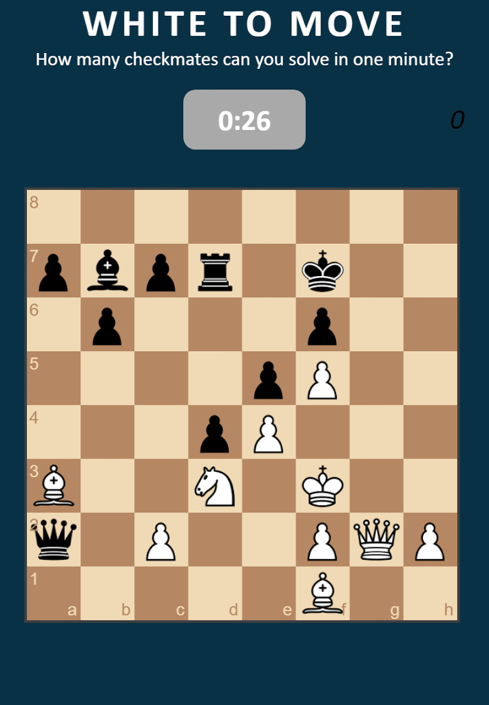

# leaderboard-as-a-service
Provide real time web leaderboard support with minimal programming necessary.

If you are a game creator or anything that can be digitized and you want a to have a real time web page leaderboard, this is a tool for you.

We provide a real time Firestore and the Firebase Cloud Functions to keep the leaderboard up to date.

See https://github.com/firebase-as-a-service/leaderboard-as-a-service/blob/master/admin/addscore.js

Contact ralph@tidalforce.org to get a credentials file and you can add scores.

Try a demonstration at https://checkmateinone.brooklyncoop.org/

An example leader board as a service clone is here: https://leaderboard-gcp-1.web.app

